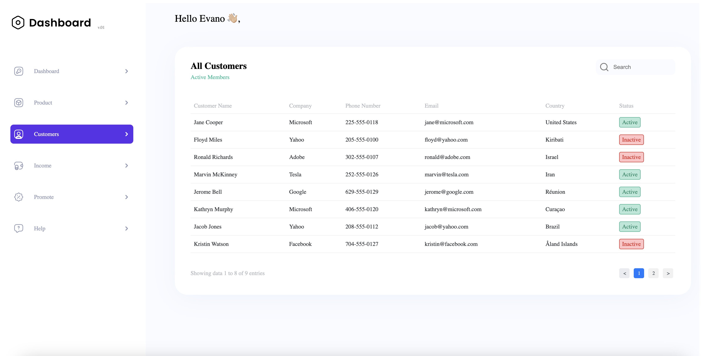

# Customer Dashboard
### Customer Dashboard - это проект, разработанный с использованием React и Vite, который позволяет управлять списком клиентов, включая функции поиска и пагинации.

# Установка
### Перед началом работы убедитесь, что у вас установлены Node.js и npm.

# Клонируйте репозиторий:

### bash
### Copy code
### git clone <URL репозитория>
## Перейдите в директорию проекта:

### bash
### Copy code
### cd <название директории>
## Установите зависимости:

### bash
### Copy code
### npm install
# Запуск проекта
## Для запуска проекта в режиме разработки выполните следующую команду:

### bash
### Copy code
### npm run dev
## Проект будет доступен по адресу http://localhost:5173.

