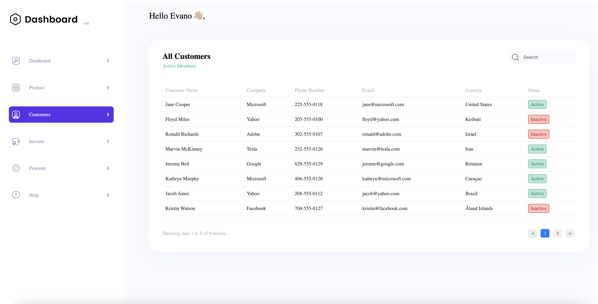

# Customer Dashboard

A responsive React dashboard demo with a searchable customer directory, pagination, and customer status toggles.



## Features

- Search nine sample customers by name, company, phone, email, or country.
- Browse results in pages of eight customers.
- Toggle a customer's active/inactive status.
- Use the sidebar on desktop and mobile, with horizontal scrolling for the customer table on narrow screens.

The customer directory is available at `/customers`. Dashboard (`/`), Product, Income, Promote, and Help are existing placeholder pages. This is a frontend demo: there is no backend, authentication, or persistent storage. Status changes stay in memory and reset when the customer page remounts or the browser reloads. The screenshot above is a reference from the original project.

## Requirements

- Node.js 22.12+ (22.x), or Node.js 24+
- npm

The `.nvmrc` file selects Node.js 22 when using nvm.

## Getting started

```sh
git clone https://github.com/nayfort/dashboard.git
cd dashboard
npm ci
npm run dev
```

Open the URL printed by Vite (normally `http://localhost:5173`) and select **Customers**, or visit `/customers` directly. No environment variables or external services are required.

## Commands

| Command | Purpose |
| --- | --- |
| `npm run dev` | Start the development server |
| `npm run lint` | Run ESLint; warnings fail the check |
| `npm run build` | Create the production bundle in `dist/` |
| `npm run preview` | Preview the production build locally |
| `npm test` | Run Chromium browser regression tests against the production build |

## Verification

```sh
npm run lint
npm run build
npx playwright install chromium
npm test
npm audit
```

On Linux CI, use `npx playwright install --with-deps chromium` to install browser system dependencies as well. Tests start their own preview server on port 4173; keep that port free.

Regression tests cover status updates after filtering and pagination, empty results, responsive navigation, page overflow, and existing routes. GitHub Actions runs lint, build, and browser tests on pushes and pull requests.

## Project structure

```text
src/
  assets/       SVG components and images
  components/   Shared sidebar and styles
  pages/        Customer directory and placeholder pages
  App.jsx       Application layout
  routes.jsx    Client-side routes
  main.jsx      React entry point
tests/         Playwright regression tests
```

Built with React 18, React Router 7, and Vite 8. Dependency versions are recorded in `package-lock.json`; use `npm ci` for reproducible installs.

## Deployment

Run `npm run build` and serve `dist/` using a static web host. Configure the host to rewrite application routes such as `/customers` to `index.html`, because the app uses `BrowserRouter`. The default configuration assumes hosting at the domain root. `npm run preview` is intended for local verification.
